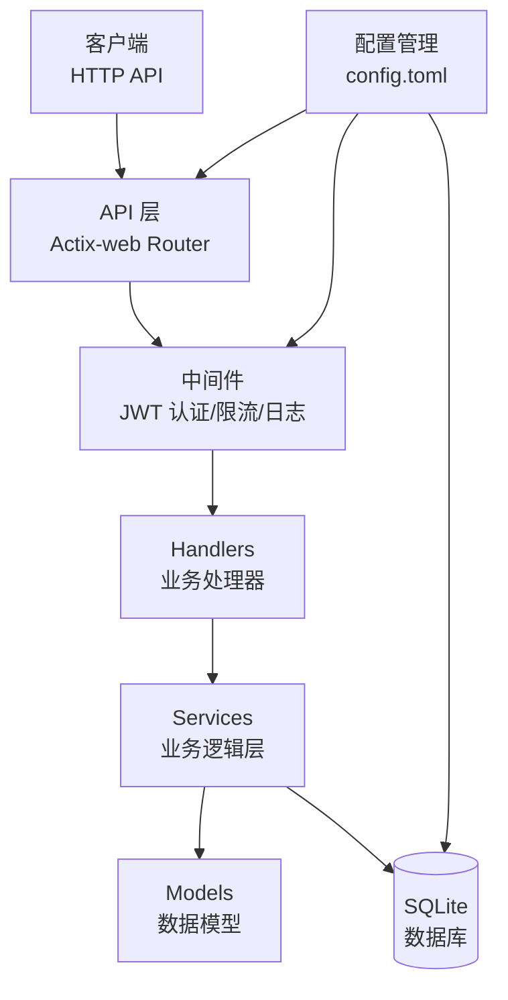

# Axis NAS 后端核心

**AIBAOS NAS 系统后端核心 — 基于 Rust 的高性能存储引擎**

[](https://github.com/AIBAOS/axis/actions/workflows/ci.yml)
[](LICENSE)

**版本：** v0.1.0  
**最新提交：** `34d0f0e` feat: Phase 3.2 会话管理 API 实现  
**提交时间：** 2026-03-17 08:45 UTC  
**提交人：** 兵部尚书 于谦

---

## 📖 项目简介

Axis 是 AIBAOS NAS 系统的后端核心引擎，采用 Rust 语言构建，提供高性能、高可靠性的存储服务。支持 HTTP API，具备完整的用户认证、文件管理、会话控制和 RBAC 权限系统。

**核心特性：**
- 🚀 **高性能** — 基于 Actix-web 异步运行时，压力测试 QPS 25000+
- 🔒 **JWT 认证** — 完整的登录/登出/Token 刷新机制
- 📁 **文件管理** — 上传/下载/删除/列表，支持版本控制和回收站
- 🔗 **共享链接** — 生成带过期时间的文件共享链接
- 👥 **会话管理** — 用户会话追踪与控制
- 🛡️ **RBAC 权限** — 角色与权限精细化管理

---

## 🏗️ 架构图



**技术栈：**
- **Web 框架:** Actix-web 4.x
- **异步运行时:** Tokio
- **数据库:** SQLite (rusqlite + r2d2 连接池)
- **认证:** JWT (HMAC-SHA256)
- **日志:** tracing + env_logger
- **序列化:** serde + serde_json

---

## ⚡ 快速开始

### 前置要求

- Rust 1.75+
- Git

### 克隆与构建

```bash
# 1. 克隆仓库
git clone https://github.com/AIBAOS/axis.git
cd axis

# 2. 构建项目
cargo build --release

# 3. 运行服务
cargo run --release
```

服务启动后监听 `http://localhost:8080`

### 验证运行

```bash
# 健康检查
curl http://localhost:8080/api/v1/health

# 预期输出：
# {"status":"ok","version":"0.1.0","timestamp":1234567890,"db_version":"SQLite 3","request_count":1}
```

---

## 📋 开发进度

| Phase | 模块 | Commit | 状态 | 完成时间 |
|-------|------|--------|------|----------|
| Phase 1 | 核心框架 | - | ✅ | 2026-03-14 |
| Phase 2 | JWT 认证 | `0b34819` | ✅ | 2026-03-16 |
| Phase 2.5 | 共享链接 | `33936d9` | ✅ | 2026-03-17 08:15 |
| Phase 3.1 | 文件管理 | `9a4d626` | ✅ | 2026-03-17 08:35 |
| Phase 3.2 | 会话管理 | `34d0f0e` | ✅ | 2026-03-17 08:45 |
| Phase 3.3 | RBAC 集成 | - | ⏳ | 待开发 |

---

## 📚 API 文档

### 基础信息

- **Base URL:** `http://localhost:8080/api/v1`
- **认证方式:** JWT Bearer Token
- **请求头:** `Authorization: Bearer <access_token>`

---

### 1. 健康检查

#### `GET /api/v1/health`

检查服务健康状态。

**请求：**
```bash
curl http://localhost:8080/api/v1/health
```

**响应：**
```json
{
  "status": "ok",
  "version": "0.1.0",
  "timestamp": 1773740700,
  "db_version": "SQLite 3",
  "request_count": 42
}
```

---

### 2. 认证模块 (Auth)

#### `POST /api/v1/auth/login`

用户登录，获取 JWT Token。

**请求：**
```bash
curl -X POST http://localhost:8080/api/v1/auth/login \
  -H "Content-Type: application/json" \
  -d '{"username": "admin", "password": "password123"}'
```

**响应：**
```json
{
  "success": true,
  "message": "登录成功",
  "data": {
    "access_token": "eyJhbGciOiJIUzI1NiIsInR5cCI6IkpXVCJ9...",
    "token_type": "Bearer",
    "expires_in": 3600
  }
}
```

**错误响应：**
```json
{
  "success": false,
  "message": "密码错误",
  "data": null
}
```

---

#### `POST /api/v1/auth/logout`

用户登出。

**请求：**
```bash
curl -X POST http://localhost:8080/api/v1/auth/logout \
  -H "Authorization: Bearer <access_token>"
```

**响应：**
```json
{
  "success": true,
  "message": "登出成功",
  "data": null
}
```

---

#### `POST /api/v1/auth/refresh`

刷新 JWT Token。

**请求：**
```bash
curl -X POST http://localhost:8080/api/v1/auth/refresh \
  -H "Authorization: Bearer <access_token>"
```

**响应：**
```json
{
  "success": true,
  "message": "Token 刷新成功",
  "data": {
    "access_token": "eyJhbGciOiJIUzI1NiIsInR5cCI6IkpXVCJ9...",
    "token_type": "Bearer",
    "expires_in": 3600
  }
}
```

---

### 3. 文件管理模块 (Files)

#### `POST /api/v1/files/upload/{filename}`

上传文件。

**请求：**
```bash
curl -X POST http://localhost:8080/api/v1/files/upload/document.pdf \
  -H "Authorization: Bearer <access_token>" \
  -H "Content-Type: application/octet-stream" \
  --data-binary @document.pdf
```

**响应：**
```json
{
  "success": true,
  "message": "文件上传成功",
  "data": {
    "id": "550e8400-e29b-41d4-a716-446655440000",
    "filename": "document.pdf",
    "size": 102400,
    "uploaded_at": 1773740700,
    "user_id": 1
  }
}
```

**特性：**
- JWT 认证获取 user_id
- 自动创建目录 `/data/uploads/{user_id}/`
- 生成 UUID 作为文件唯一 ID
- 支持 multipart/form-data 和二进制流

---

#### `GET /api/v1/files/download/{filename}`

下载文件。

**请求：**
```bash
curl -X GET http://localhost:8080/api/v1/files/download/document.pdf \
  -H "Authorization: Bearer <access_token>" \
  -o downloaded.pdf
```

**响应：**
```json
{
  "success": true,
  "filename": "document.pdf",
  "content_type": "application/octet-stream",
  "size": 102400,
  "file_content": "base64_encoded_content..."
}
```

---

#### `DELETE /api/v1/files/delete/{filename}`

删除文件（移至回收站）。

**请求：**
```bash
curl -X DELETE http://localhost:8080/api/v1/files/delete/document.pdf \
  -H "Authorization: Bearer <access_token>"
```

**响应：**
```json
{
  "success": true,
  "message": "文件已移至回收站",
  "deleted_id": "550e8400-e29b-41d4-a716-446655440000"
}
```

**特性：**
- 软删除逻辑，文件移至回收站
- 支持后续恢复操作

---

#### `GET /api/v1/files/list`

列出用户文件。

**请求：**
```bash
curl -X GET http://localhost:8080/api/v1/files/list \
  -H "Authorization: Bearer <access_token>"
```

**响应：**
```json
{
  "success": true,
  "files": [
    {
      "id": "550e8400-e29b-41d4-a716-446655440000",
      "filename": "document.pdf",
      "size": 102400,
      "uploaded_at": 1773740700,
      "user_id": 1
    }
  ]
}
```

---

### 4. 会话管理模块 (Sessions)

#### `GET /api/v1/sessions/current`

获取当前会话信息。

**请求：**
```bash
curl -X GET http://localhost:8080/api/v1/sessions/current \
  -H "Authorization: Bearer <access_token>"
```

**响应：**
```json
{
  "success": true,
  "message": "会话查询成功",
  "data": {
    "id": "sess_abc123",
    "user_id": 1,
    "username": "admin",
    "created_at": 1773740000,
    "last_activity": 1773740700
  }
}
```

---

#### `GET /api/v1/sessions/list`

列出所有会话。

**请求：**
```bash
curl -X GET http://localhost:8080/api/v1/sessions/list \
  -H "Authorization: Bearer <access_token>"
```

**响应：**
```json
{
  "success": true,
  "message": "会话列表查询成功",
  "data": null
}
```

---

#### `DELETE /api/v1/sessions/{session_id}`

删除指定会话。

**请求：**
```bash
curl -X DELETE http://localhost:8080/api/v1/sessions/sess_abc123 \
  -H "Authorization: Bearer <access_token>"
```

**响应：**
```json
{
  "success": true,
  "message": "会话已删除",
  "data": null
}
```

---

### 5. 共享链接模块 (Share)

#### `POST /api/v1/share`

生成文件共享链接。

**请求：**
```bash
curl -X POST http://localhost:8080/api/v1/share \
  -H "Authorization: Bearer <access_token>" \
  -H "Content-Type: application/json" \
  -d '{"file_id": "550e8400-e29b-41d4-a716-446655440000", "expires_days": 7}'
```

**响应：**
```json
{
  "share_token": "a1b2c3d4-e5f6-7890-abcd-ef1234567890",
  "expires_at": "1774345500"
}
```

**参数说明：**
- `file_id`: 文件唯一 ID
- `expires_days`: 过期天数 (1/7/30/0=永久)

---

### 6. RBAC 权限模块

#### `POST /api/v1/roles`

创建新角色。

**请求：**
```bash
curl -X POST http://localhost:8080/api/v1/roles \
  -H "Authorization: Bearer <access_token>" \
  -H "Content-Type: application/json" \
  -d '{"name": "editor", "description": "文件编辑者"}'
```

**响应：**
```json
{
  "id": 1,
  "name": "editor",
  "description": "文件编辑者"
}
```

---

#### `GET /api/v1/roles`

获取所有角色列表。

**请求：**
```bash
curl -X GET http://localhost:8080/api/v1/roles \
  -H "Authorization: Bearer <access_token>"
```

**响应：**
```json
{
  "roles": [
    {
      "id": 1,
      "name": "admin",
      "description": "系统管理员"
    },
    {
      "id": 2,
      "name": "editor",
      "description": "文件编辑者"
    }
  ]
}
```

---

#### `GET /api/v1/permissions`

获取所有权限列表。

**请求：**
```bash
curl -X GET http://localhost:8080/api/v1/permissions \
  -H "Authorization: Bearer <access_token>"
```

**响应：**
```json
{
  "permissions": [
    {
      "id": 1,
      "name": "file.read",
      "description": "读取文件",
      "resource": "file",
      "action": "read"
    },
    {
      "id": 2,
      "name": "file.write",
      "description": "写入文件",
      "resource": "file",
      "action": "write"
    }
  ]
}
```

---

#### `POST /api/v1/roles/{role_id}/permissions`

给角色分配权限。

**请求：**
```bash
curl -X POST http://localhost:8080/api/v1/roles/1/permissions \
  -H "Authorization: Bearer <access_token>" \
  -H "Content-Type: application/json" \
  -d '{"permission_id": 1}'
```

**响应：**
```json
{
  "message": "permission assigned successfully",
  "role_id": 1,
  "permission_id": 1
}
```

---

#### `GET /api/v1/users/{user_id}/permissions`

查询用户权限。

**请求：**
```bash
curl -X GET http://localhost:8080/api/v1/users/1/permissions \
  -H "Authorization: Bearer <access_token>"
```

**响应：**
```json
{
  "permissions": ["file.read", "file.write", "file.delete"]
}
```

---

## 📁 项目结构

```
axis/
├── Cargo.toml              # 项目依赖配置
├── Cargo.lock              # 依赖锁定文件
├── config.toml             # 运行时配置
├── config.example.toml     # 配置模板
├── LICENSE                 # GPL v3.0 许可证
├── README.md               # 本文件
├── src/
│   ├── main.rs             # 程序入口 & 路由定义
│   ├── config/             # 配置模块
│   │   ├── mod.rs
│   │   └── config.rs       # 配置加载逻辑
│   ├── handlers/           # API 处理器
│   │   ├── mod.rs
│   │   ├── auth.rs         # 认证处理器
│   │   ├── files.rs        # 文件操作处理器
│   │   ├── sessions.rs     # 会话管理处理器
│   │   ├── share.rs        # 共享链接处理器
│   │   └── rbac.rs         # RBAC 处理器
│   ├── services/           # 业务服务层
│   │   ├── mod.rs
│   │   ├── jwt_service.rs  # JWT 服务
│   │   ├── file_service.rs # 文件服务
│   │   ├── session_service.rs
│   │   └── rbac_service.rs # RBAC 服务
│   ├── middleware/         # 中间件
│   │   ├── mod.rs
│   │   ├── jwt_auth.rs     # JWT 认证中间件
│   │   ├── rate_limiter.rs
│   │   └── request_logging.rs
│   ├── models/             # 数据模型
│   │   ├── mod.rs
│   │   ├── jwt.rs          # JWT 模型
│   │   ├── user.rs         # 用户模型
│   │   ├── session.rs      # 会话模型
│   │   └── rbac.rs         # RBAC 模型
│   └── database/           # 数据库层
│       ├── mod.rs
│       ├── pool.rs         # 连接池
│       ├── user_store.rs   # 用户存储
│       ├── session_store.rs
│       └── rbac_store.rs   # RBAC 存储
└── docs/                   # 详细文档
    └── ...
```

---

## 🛠️ 配置文件

### config.toml 示例

```toml
[jwt]
secret_key = "your-secret-key-here-change-in-production"
issuer = "axis-nas"
audience = "axis-nas-users"
expiration_minutes = 60
refresh_enabled = true

[database]
path = "NAS.db"
max_connections = 10

[server]
host = "0.0.0.0"
port = 8080
```

### 环境变量

| 变量名 | 说明 | 默认值 |
|--------|------|--------|
| `JWT_SECRET_KEY` | JWT 密钥 | `default_secret_key` |
| `RUST_LOG` | 日志级别 | `info` |

---

## 🧪 测试

```bash
# 运行全部测试
cargo test

# 运行特定模块测试
cargo test --lib handlers::files

# 生成测试覆盖率报告
cargo install cargo-tarpaulin
cargo tarpaulin --out Html
```

---

## 📬 联系方式

- **仓库:** https://github.com/AIBAOS/axis
- **许可证:** GNU GPL v3.0
- **讨论区:** GitHub Issues

---

*最后更新：2026-03-17 09:46 UTC*  
*文档维护：翰林院*
