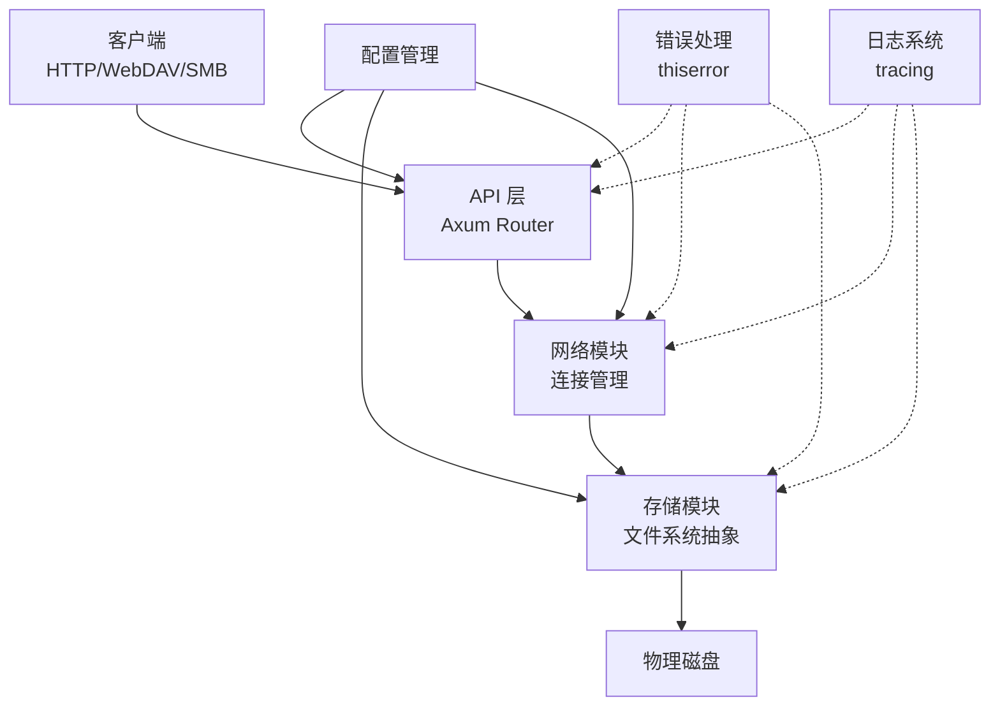

# Axis

**AIBAOS NAS 系统后端核心 — 基于 Rust 的高性能存储引擎**

[](https://github.com/AIBAOS/axis/actions/workflows/ci.yml)
[](LICENSE)

---

## 📖 项目简介

Axis 是 AIBAOS NAS 系统的后端核心引擎，采用 Rust 语言构建，提供高性能、高可靠性的存储服务。支持 HTTP/WebDAV/SMB 协议，具备分布式存储能力，为家庭和企业用户提供安全、便捷的数据管理解决方案。

**核心特性：**
- 🚀 **高性能** — 基于 Tokio 异步运行时，充分利用多核 CPU
- 🔒 **高可靠** — 完善的错误处理和数据校验机制
- 📦 **模块化** — 清晰的存储/网络/API 分层架构
- 🛠️ **易扩展** — 支持插件化协议扩展（WebDAV/SMB/FTP）

---

## 🏗️ 架构图



**模块说明：**

| 模块 | 职责 | 关键技术 |
|------|------|----------|
| `api/` | HTTP 路由、请求处理、响应序列化 | axum, serde |
| `network/` | 连接管理、协议解析、TLS 加密 | tokio, rustls |
| `storage/` | 文件系统抽象、IO 操作、缓存 | tokio::fs |
| `config/` | 配置加载、环境变量、热更新 | config crate |
| `error/` | 统一错误类型、错误转换 | thiserror |

---

## ⚡ 快速开始

**5 分钟内跑起来！**

### 前置要求

- Rust 1.75+ ([安装指南](https://www.rust-lang.org/tools/install))
- Git

### 克隆与构建

```bash
# 1. 克隆仓库
git clone https://github.com/AIBAOS/axis.git
cd axis

# 2. 构建项目
cargo build --release

# 3. 运行服务
cargo run --release
```

服务启动后监听 `http://localhost:8080`

### 验证运行

```bash
# 健康检查
curl http://localhost:8080/health

# 预期输出：{"status":"ok","version":"0.1.0"}
```

---

## 🛠️ 开发环境配置

### 1. 安装 Rust 工具链

```bash
curl --proto '=https' --tlsv1.2 -sSf https://sh.rustup.rs | sh
rustup default stable
```

### 2. 安装开发工具

```bash
# 代码格式化
rustup component add rustfmt

# 代码检查
rustup component add clippy

# 依赖安全审计
cargo install cargo-audit
```

### 3. 配置 IDE

**VS Code 推荐插件：**
- rust-analyzer (官方 Rust 语言支持)
- crates (依赖版本检查)
- CodeLLDB (调试器)

**settings.json 推荐配置：**
```json
{
  "rust-analyzer.checkOnSave.command": "clippy",
  "rust-analyzer.inlayHints.parameterHints.enable": true
}
```

### 4. 运行测试

```bash
# 运行全部测试
cargo test

# 运行特定模块测试
cargo test --lib storage

# 生成测试覆盖率报告
cargo install cargo-tarpaulin
cargo tarpaulin --out Html
```

---

## 📁 项目结构

```
axis/
├── Cargo.toml          # 项目配置与依赖
├── Cargo.lock          # 依赖锁定文件
├── README.md           # 本文件
├── LICENSE             # Apache 2.0 许可证
├── .gitignore          # Git 忽略规则
├── .github/
│   └── workflows/      # GitHub Actions CI/CD
│       ├── ci.yml      # 持续集成
│       └── security.yml # 安全审计
├── src/
│   ├── main.rs         # 程序入口
│   ├── lib.rs          # 库根
│   ├── config.rs       # 配置管理
│   ├── error.rs        # 错误定义
│   ├── api/            # HTTP API 层
│   │   ├── mod.rs
│   │   ├── routes.rs
│   │   └── handlers.rs
│   ├── network/        # 网络模块
│   │   ├── mod.rs
│   │   └── connection.rs
│   └── storage/        # 存储模块
│       ├── mod.rs
│       ├── filesystem.rs
│       └── cache.rs
├── tests/              # 集成测试
│   └── api_test.rs
└── docs/               # 详细文档
    ├── architecture.md # 架构设计
    ├── api.md          # API 文档
    └── development.md  # 开发规范
```

---

## 📚 文档导航

| 文档 | 说明 |
|------|------|
| [架构设计](docs/architecture.md) | 系统架构、模块划分、设计决策 |
| [API 文档](docs/api.md) | REST API 接口说明、请求/响应示例 |
| [开发规范](docs/development.md) | 代码风格、提交规范、审查流程 |

---

## 🤝 贡献指南

欢迎贡献！请遵循以下流程：

### 1. Fork 与克隆

```bash
git clone https://github.com/YOUR_USERNAME/axis.git
cd axis
git remote add upstream https://github.com/AIBAOS/axis.git
```

### 2. 创建分支

```bash
git checkout -b feature/your-feature-name
```

### 3. 开发与测试

```bash
# 编写代码
# ...

# 格式化
cargo fmt

# 检查
cargo clippy -- -D warnings

# 测试
cargo test
```

### 4. 提交代码

```bash
git add .
git commit -m "feat: 添加 XXX 功能

- 详细说明 1
- 详细说明 2

Closes #123"
```

**提交信息规范：**
- `feat:` 新功能
- `fix:` Bug 修复
- `docs:` 文档更新
- `style:` 代码格式（不影响功能）
- `refactor:` 重构（非新功能）
- `test:` 测试相关
- `chore:` 构建/工具链

### 5. 发起 Pull Request

1. 推送分支：`git push origin feature/your-feature-name`
2. 在 GitHub 创建 PR
3. 等待 CI 通过
4. 响应审查意见

---

## 📋 开发任务清单

**当前迭代 (v0.1)：**

- [x] 项目骨架初始化
- [ ] 基础 HTTP 服务
- [ ] 存储模块实现
- [ ] 配置管理系统
- [ ] 日志系统集成
- [ ] 单元测试覆盖

**路线图：**
- v0.1: 基础存储 + HTTP API
- v0.2: WebDAV/SMB 协议支持
- v0.3: 分布式/集群能力
- v1.0: 生产就绪

---

## 📜 许可证

本项目采用 **Apache License 2.0** 开源。详见 [LICENSE](LICENSE) 文件。

---

## 📬 联系方式

- 仓库：https://github.com/AIBAOS/axis
- 讨论区：GitHub Issues
- 即时通讯：Discord #aibaos 频道

---

*最后更新：2026-03-14*
